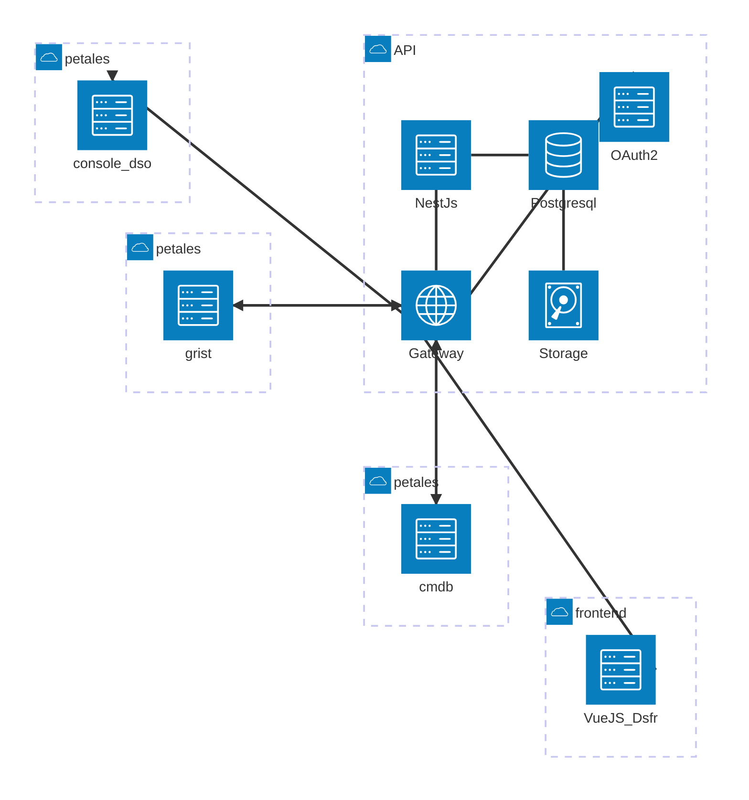

<h1 style="text-align: center;">Référentiel des Produits Numériques</h1>

 

 

 

## [Cartographie du SI](./2)

 

 

## [Doctrine](./9)

  <button @click="$slidev.nav.openInEditor()" title="Editer" class="text-xl slidev-icon-btn opacity-50 !border-none !hover:text-white">
    <carbon:edit />
  </button>
  <a href="https://github.com/dnum-mi/referentiel-applications" target="_blank" alt="GitHub" title="Open in GitHub"
    class="text-xl slidev-icon-btn opacity-50 !border-none !hover:text-white">
    <carbon-logo-github />
  </a>
  <SlidesTotal />

---
layout: image-left
image: /images/DALL·E-2024-11-01-13.06.13.jpg
transition: fade-out
class: 'custom-background-14px'
---

<h2 style="text-align: center;">Introduction</h2>

 

- Le référentiel des applications représente l'ensemble des produits numériques et logiciels utilisés au sein du système d'information;
  
- Il permet de centraliser, structurer, et gérer efficacement  pour un accès et une utilisation optimisés;

- Il "participe à la protection, à la défense et à la résilience du système d’information"[(*)](https://cyber.gouv.fr/publications/cartographie-du-systeme-dinformation). 

- Il est adressé à l'ensemble des acteurs du Système d'information.

 

<h3 style="text-align: center;">Tous concernés</h3>

  <button @click="$slidev.nav.openInEditor()" title="Editer" class="text-xl slidev-icon-btn opacity-50 !border-none !hover:text-white">
    <carbon:edit />
  </button>
  <a href="https://github.com/dnum-mi/referentiel-applications" target="_blank" alt="GitHub" title="Open in GitHub"
    class="text-xl slidev-icon-btn opacity-50 !border-none !hover:text-white">
    <carbon-logo-github />
  </a>

---
layout: image-left
image: /images/DALL·E-2024-11-01-13.06.13.jpg
transition: fade-out
class: 'custom-background-14px'
---

<h2 style="text-align: center;">Objectifs du référentiel</h2>

  

- **Centralisation** : Rassembler toutes les fiches produits dans un seul point de vérité;
  
- **Facilité d'accès** : Avoir une vue précise et d'ensemble des produits (*fiche du produit*);
  
<v-clicks>    

   &#x2705; patrimoine applicatif du ministère; 
 
   &#x2705; l'ensemble des applications hébergées et supervisées 

- **Gestion des dépendances** : Comprendre les interconnexions et dépendances entre applications;

- **Amélioration de la maintenance** : Simplifier les processus de mise à jour et d’audit;

- **Amélioration de l'exploitabilité** : Mesurer plus facilement les impacts d'incidents opérationnels;

</v-clicks>

  <button @click="$slidev.nav.openInEditor()" title="Editer" class="text-xl slidev-icon-btn opacity-50 !border-none !hover:text-white">
    <carbon:edit />
  </button>
  <a href="https://github.com/dnum-mi/referentiel-applications" target="_blank" alt="GitHub" title="Open in GitHub"
    class="text-xl slidev-icon-btn opacity-50 !border-none !hover:text-white">
    <carbon-logo-github />
  </a>

---
layout: image-left
image: /images/DALL·E-2024-11-01-13.06.13.jpg
transition: fade-out
class: 'custom-background-14px'
---

<h2 style="text-align: center;">Structure du référentiel</h2>

 

<v-click>

- **Application centrale** : Il s'agit du point de vérité, (*coeur de la fleur*) partageant les données utiles (*numéro d'affaire, identifiant unique, nom, description, etc.*) à l'ensemble des contributeurs et usagers du SI;

- **Modules associés** : Applications et outils externes (les *pétales*) connectés au référentiel;
   
- **Gestion des interfaces et des flux de données** : Représentation des inter-actions applicatives et leurs flux de données.

- **Suivi des flux** : Outils de monitoring pour détecter et résoudre les problèmes potentiels.

<!-- pétales points d'acquisition et de consommation -->

</v-click>

  <button @click="$slidev.nav.openInEditor()" title="Editeur" class="text-xl slidev-icon-btn opacity-50 !border-none !hover:text-white">
    <carbon:edit />
  </button>
  <a href="https://github.com/dnum-mi/referentiel-applications" target="_blank" alt="GitHub" title="Open in GitHub"
    class="text-xl slidev-icon-btn opacity-50 !border-none !hover:text-white">
    <carbon-logo-github />
  </a>

<!-- Visualisation des connexions stratégiques entre applications -->

---
layout: image-left
image: /images/DALL·E-2024-11-01-13.06.13.jpg
transition: fade-out
class: 'custom-background-14px'
---

<h2 style="text-align: center;">Modules associés</h2>
<h3 style="text-align: center;">automatisation</h3>

 

<v-click>

- &#x1F50C; **API Exposée** : Le référentiel expose une API pour permettre  l’automatisation des mises à jour  et l'intégration avec d'autres systèmes;

- &#x1F511; **Identification des applications** : Chaque consommateur de l'API est identifié de manière unique par une **API Key** afin d'accéder aux données; 

- &#x1F504; **Mise à jour Automatique** : Les informations du référentiel sont maintenues à jour sans intervention manuelle augmentant la qualité des données tout   en réduisant la charge de travail de l'agent. 

</v-click>

   <button @click="$slidev.nav.openInEditor()" title="Editer" class="text-xl slidev-icon-btn opacity-50 !border-none !hover:text-white">
    <carbon:edit />
  </button>
  <a href="https://api-referentiel-applications.apps.app1.numerique-interieur.com/api/v1" target="_blank" alt="API" title="Swagger"
    class="text-xl slidev-icon-btn opacity-50 !border-none !hover:text-white">
    <carbon-api-1 />
  </a>
  <a href="https://github.com/dnum-mi/referentiel-applications" target="_blank" alt="GitHub" title="Ouvri dans GitHub"
    class="text-xl slidev-icon-btn opacity-50 !border-none !hover:text-white">
    <carbon-logo-github />
  </a>

---
layout: image-left
image: /images/DALL·E-2024-11-01-13.06.13.jpg
transition: fade-out
class: 'custom-background-14px'
---

<h2 style="text-align: center;">Avantages d'un référentiel centralisé et connecté</h2>

 

- **Efficacité opérationnelle** : Réduction des redondances et optimisation des ressources;
  
- **Prise de décision** : Accès rapide aux informations clés pour un meilleur pilotage;
  
- **Conformité et sécurité** : Facilitation des audits, amélioration de la sécurité et meilleur appréciation des actes de compromission;
  
- **Temps à valeur ajoutée** : Redonner du temps utile aux agents et partenaires du ministère.

<!-- https://cyber.gouv.fr/faq-systemes-dinformation-dimportance-vitale -->

  <button @click="$slidev.nav.openInEditor()" title="Editer" class="text-xl slidev-icon-btn opacity-50 !border-none !hover:text-white">
    <carbon:edit />
  </button>
  <a href="https://github.com/dnum-mi/referentiel-applications" target="_blank" alt="GitHub" title="Open in GitHub"
    class="text-xl slidev-icon-btn opacity-50 !border-none !hover:text-white">
    <carbon-logo-github />
  </a>

---
layout: two-cols
transition: fade-out
class: 'custom-default-12px'
---

# Architecture logicielle

 

- Chaque consommateur(*pétales*) du service est authentifié;
- Authentifcation: ***API-KEY***
- Les consommateurs/fournisseurs peuvent être :
  - le processus traitant des demandes clients (ex: intialisation du *numéro d'affaire*);
  - les consoles cloud;
  - les solutions de ticketing (ex: *minitil*...);
  - les services archi infra / réseaux;
  - les services d'infrastructure (ex: cmdb)
  - les services de supervision;
  - les sous direction ayant des besoins spécifiques et opérationnels (ex: *via grist*)
  - ...

 

::right::

  <button @click="$slidev.nav.openInEditor()" title="Editer" class="text-xl slidev-icon-btn opacity-50 !border-none !hover:text-white">
    <carbon:edit />
  </button>
  <a href="https://github.com/dnum-mi/referentiel-applications" target="_blank" alt="GitHub" title="Open in GitHub"
    class="text-xl slidev-icon-btn opacity-50 !border-none !hover:text-white">
    <carbon-logo-github />
  </a>

---
layout: image-left
image: /images/DALL·E-2024-11-01-13.06.13.jpg
transition: fade-out
class: 'custom-background-14px'
---

<h2 style="text-align: center;">Conclusion</h2>

 

 

 

- Un référentiel des applications bien structuré est essentiel pour un système d'information efficace, sécurisé et évolutif.

- Un référentiel des applications accessible et connecté redonnant du temps aux agents
  

  <button @click="$slidev.nav.openInEditor()" title="Editer" class="text-xl slidev-icon-btn opacity-50 !border-none !hover:text-white">
    <carbon:edit />
  </button>
  <a href="https://github.com/dnum-mi/referentiel-applications" target="_blank" alt="GitHub" title="Open in GitHub"
    class="text-xl slidev-icon-btn opacity-50 !border-none !hover:text-white">
    <carbon-logo-github />
  </a>

---
layout: image-left
image: /images/DALL·E-2024-11-01-13.06.13.jpg
transition: fade-out
class: 'custom-background-12px'
---

<h2 style="text-align: center;"> Doctrine </h2>

 

### Pour qui ?

 

- Direction Générale et Décideurs Stratégiques;
- Les Métiers;
- Direction de la Transformation Numérique;
- SGAMI;
- Architectes (*d'Entreprise*, *Solution*, *infra*,...);
- SSI;
- Auditeurs et Conformité (*RGPD, RGAA, etc.*);
- Équipes Produits;
- Responsables Exploitations et Supervisions Techniques

<!-- Utilisateurs finaux dans le cas notamment des logiciels utiisés sur le poste de travail -->
 

   <button @click="$slidev.nav.openInEditor()" title="Editer" class="text-xl slidev-icon-btn opacity-50 !border-none !hover:text-white">
    <carbon:edit />
  </button>
  <a href="https://github.com/dnum-mi/referentiel-applications" target="_blank" alt="GitHub" title="Ouvri dans GitHub"
    class="text-xl slidev-icon-btn opacity-50 !border-none !hover:text-white">
    <carbon-logo-github />
  </a>

---
layout: image-left
image: /images/DALL·E-2024-11-01-13.06.13.jpg
transition: fade-out
class: 'custom-background-12px'
---

<h2 style="text-align: center;"> Doctrine </h2>

 

### Pour quoi ?

 

- **Compréhension globale** : Fournir une vue d'ensemble claire des applications et de leurs interactions pour aider à la prise de décisions stratégiques;
   
- **Sécurité et conformité** : Cartographier les flux de données pour assurer leur sécurité et répondre aux exigences réglementaires;

- **Exploitabilité et impacts opérationnels** : Faciliter la compréhension et la gestion des incidents impliquants des applications;

- **Gestion des changements** : Faciliter l'évaluation des impacts des changements et transformation au sein du système d'informations;

- **Optimisation des ressources** : Identifier les redondances et les opportunités de rationalisation des applications.

  

   <button @click="$slidev.nav.openInEditor()" title="Editer" class="text-xl slidev-icon-btn opacity-50 !border-none !hover:text-white">
    <carbon:edit />
  </button>
  <a href="https://github.com/dnum-mi/referentiel-applications" target="_blank" alt="GitHub" title="Ouvri dans GitHub"
    class="text-xl slidev-icon-btn opacity-50 !border-none !hover:text-white">
    <carbon-logo-github />
  </a>

---
layout: image-left
image: /images/DALL·E-2024-11-01-13.06.13.jpg
transition: fade-out
class: 'custom-background-14px'
---

<h2 style="text-align: center;"> Doctrine </h2>
<h3 style="text-align: center;font-style: italic;"> #gouvernance </h3>

 

- **Mise en place d’un comité de gouvernance** : Le comité regroupe l'ensemble entités et acteurs (*authentifiés*) contribuant à la mise à jour du référentiel. Il permettra par décisions collégiales d'intégrer de nouveaux attributs de données éligibles aux points de vérité (*le coeur*). Superviser l’utilisation des outils d’automatisation, vérifier la conformité et l’alignement avec la stratégie de l’entreprise;
    
- **Journalisation et auditabilité** : Assurer une journalisation complète des actions automatisées pour pouvoir effectuer des audits et retracer les modifications;
   
- **KPIs d'automatisation** : Développer des indicateurs pour mesurer l'efficacité des processus automatisés, comme le taux de mises à jour automatisées ou la réduction du temps de mise à jour.

  

   <button @click="$slidev.nav.openInEditor()" title="Editer" class="text-xl slidev-icon-btn opacity-50 !border-none !hover:text-white">
    <carbon:edit />
  </button>
  <a href="https://github.com/dnum-mi/referentiel-applications" target="_blank" alt="GitHub" title="Ouvri dans GitHub"
    class="text-xl slidev-icon-btn opacity-50 !border-none !hover:text-white">
    <carbon-logo-github />
  </a>

---
layout: image-left
image: /images/DALL·E-2024-11-01-13.06.13.jpg
transition: fade-out
class: 'custom-background-12px'
---

<h2 style="text-align: center;"> Doctrine </h2>
<h3 style="text-align: center;font-style: italic;"> #automisation </h3>

<v-click>

- &#x1F500; **Automatisation des collectes initiales** : Mettre en place des traitements, services pour récupérer et injecter automatiquement les données des applications et des systèmes dans le référentiel (  &#x1F6B0; données : MAJO, CANEL v1, PAI, Tableur SDAN  etc...  )

- &#x1F50E; **Surveillance des changements** : Déployer des mécanismes qui détectent et présentent automatiquement les changements dans les systèmes tiers (par exemple, modification d'une API ou d'une architecture);
  
- &#x2705; **Validation automatisée** : Ajouter une validation automatique des données avant leur intégration dans le référentiel pour assurer la qualité des informations;
  
- &#x1F440; **Validation manuelle (*data stewardship*)** : Ajouter une validation manuelle des données avant leur intégration dans le référentiel pour assurer la qualité des informations (par exemple : dédoublonnage);
  
- &#x1F440; **Curation**: Assurer l'amélioration de la qualité des données dans une démarche collaborative.
</v-click>

   <button @click="$slidev.nav.openInEditor()" title="Editer" class="text-xl slidev-icon-btn opacity-50 !border-none !hover:text-white">
    <carbon:edit />
  </button>
  <a href="https://github.com/dnum-mi/referentiel-applications" target="_blank" alt="GitHub" title="Ouvri dans GitHub"
    class="text-xl slidev-icon-btn opacity-50 !border-none !hover:text-white">
    <carbon-logo-github />
  </a>

---
layout: image-left
image: /images/DALL·E-2024-11-01-13.06.13.jpg
transition: fade-out
class: 'custom-background-14px'
---

<h2 style="text-align: center;"> Doctrine </h2>
<h3 style="text-align: center;font-style: italic;"> #formations </h3>

 

- **Formation des équipes techniques** : Assurer que les équipes en charge de la cartographie, ainsi que les autres contributeurs clés, soient formées aux technologies et aux processus d'automatisation.
    
- **Sensibilisation des utilisateurs** : Informer les utilisateurs sur les avantages de l'automatisation pour encourager leur adoption et leur participation. Une participation qui est au service du collectif.

   <button @click="$slidev.nav.openInEditor()" title="Editer" class="text-xl slidev-icon-btn opacity-50 !border-none !hover:text-white">
    <carbon:edit />
  </button>
  <a href="https://github.com/dnum-mi/referentiel-applications" target="_blank" alt="GitHub" title="Ouvri dans GitHub"
    class="text-xl slidev-icon-btn opacity-50 !border-none !hover:text-white">
    <carbon-logo-github />
  </a>

---
layout: image-left
image: /images/DALL·E-2024-11-01-13.06.13.jpg
transition: fade-out
class: 'custom-background-14px'
---

<h2 style="text-align: center;"> Doctrine </h2>
<h3 style="text-align: center;font-style: italic;"> #conclusion </h3>

 

<v-click>

La doctrine de la cartographie du Système d'Informations (SI) devient une entité proactive, capable de :

- Se mettre à jour en *temps réel*; 
- Répondre rapidement aux changements dans l'écosystème des applications et des technologies;
- Améliorer à la fois la précision et la fiabilité du référentiel;
- Permettre une meilleure réactivité face aux évolutions du SI;
- Permettre également une meilleure maîtrise des risques liés à la transformaton du SI.

</v-click>

   <button @click="$slidev.nav.openInEditor()" title="Editer" class="text-xl slidev-icon-btn opacity-50 !border-none !hover:text-white">
    <carbon:edit />
  </button>
  <a href="https://github.com/dnum-mi/referentiel-applications" target="_blank" alt="GitHub" title="Ouvri dans GitHub"
    class="text-xl slidev-icon-btn opacity-50 !border-none !hover:text-white">
    <carbon-logo-github />
  </a>

---
layout: image-left
image: /images/DALL·E-2024-11-01-13.06.13.jpg
transition: fade-out
class: 'custom-background-14px'
---

<h2 style="text-align: center;">Questions ?</h2>

  <button @click="$slidev.nav.openInEditor()" title="Editer" class="text-xl slidev-icon-btn opacity-50 !border-none !hover:text-white">
    <carbon:edit />
  </button>
  <a href="https://github.com/dnum-mi/referentiel-applications" target="_blank" alt="GitHub" title="Open in GitHub"
    class="text-xl slidev-icon-btn opacity-50 !border-none !hover:text-white">
    <carbon-logo-github />
  </a>

